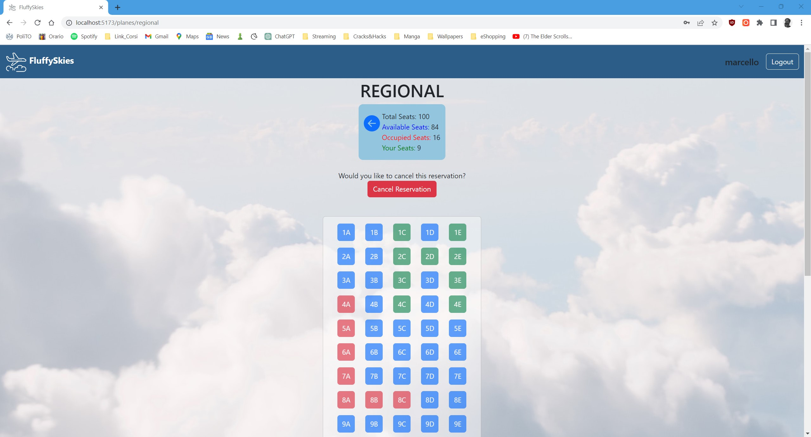

# Exam #2: "Airplane Seats"
## Student: s318904 MARCELLO VITAGGIO 

## React Client Application Routes

- Route `/`: no content, redirect to `/planes`
- Route `/planes`: home page, shows the visitable plane seats view and a description   
- Route `/planes/:type`: displays the seat view for both non-authenticated and authenticated users. Authenticated users can book a reservation if it does not already exist or cancel an existing reservation. Authenticated users can select seats to reserve either manually, by clicking on the seats, or automatically, by specifying the number of seats to book. The `:type` parameter in the route can vary between `local`, `regional`, and `international` to correspond to the specific type of plane being viewed.
- Route `/login`: login page
- Route `*`: for invalid routes, a button redirect to the home page

## API Server

### Authentication

- POST `/api/sessions`
  - This route is used for performing login.
  - request parameters: None
  - request body content: { "username": "string", "password": "string" }
  - response body content: { "id": "number", "username": "string", "reservations": "array" } or { "error": "string" }

- GET `/api/sessions/current`
  - This route checks whether the user is logged in or not.
  - request parameters: None
  - response body content: { "id": "number", "username": "string", "reservations": "array" } if authenticated or { "error": "string" } if not authenticated

- DELETE `/api/sessions/current`
  - This route is used for logging out the current user.
  - request parameters: None
  - response body content: Empty body

### Planes APIs

- GET `/api/planes/:type/seats`
  - This route retrieves the airplane information (including seats) for a specific plane type.
  - request parameters: { "type": "string" } (e.g., 'local', 'regional', 'international')
  - response body content: { "type": "string", "seats": "array" } or { "error": "string" }

- GET `/api/users/:id/reservations`
  - This route retrieves the reservations for a specific user.
  - request parameters: { "id": "number" } (user ID)
  - response body content: { "reservations": "array" } or { "error": "string" }

- PUT `/api/planes/:type/user/:id`
  - This route is used for making a reservation for a specific plane type and user.
  - request parameters: { "type": "string", "id": "number" } (e.g., '1', '2', '3' for different plane types, user ID)
  - request body content: { "seats": "array" } (seats to reserve)
  - response body content: { "success": "string" } or { "error": "string" } or { "error": "string", "invalidSeats":"array"} if conflict case
  
- DELETE `/api/user/:id/planes/:type`
  - This route is used for deleting a reservation for a specific user and plane type.
  - request parameters: { "id": "number", "type": "number" } (user ID, plane type)
  - response body content: { "success": "string" } or { "error": "string" }

## Database Tables

- Table `users` - contains: id - username - hash - salt - reservations
- Table `planes` - contains: type - seats

## Main React Components

- `LoginForm` (in `LoginForm.js`): This component handles the login functionality. It includes a form with input fields for username and password. It uses the useState hook to manage the form data and the useNavigate hook from react-router-dom for navigation.
- `HomePage` (in `HomePage.js`): This component displays a list of planes with their respective types, descriptions, and images. It uses the Link component from react-router-dom to create links to individual plane pages.
- `PlaneOverview` (in `PlaneOverview.js`): This component displays detailed information about a specific plane based on the type parameter. It includes seat selection functionality and allows users to book seats. It interacts with an API to fetch data about occupied and booked seats. It also provides options for manual or automatic seat selection.

## Screenshot

## Users Credentials

- marcello, password1 
- luigi, password2 
- fulvio, password3 
- luca, password4
